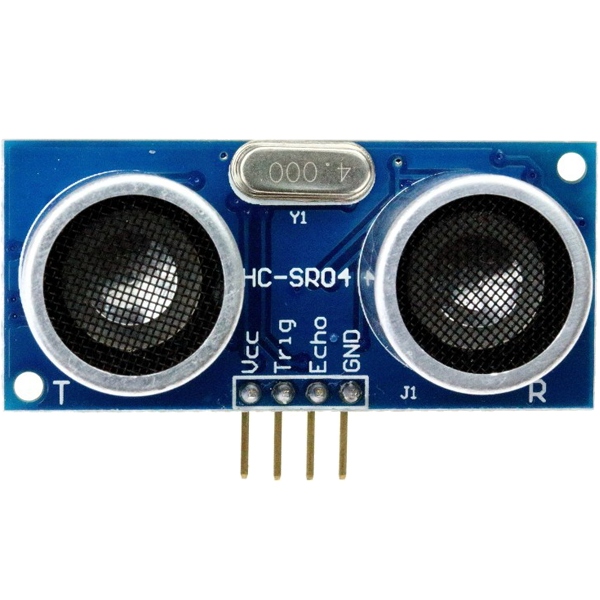
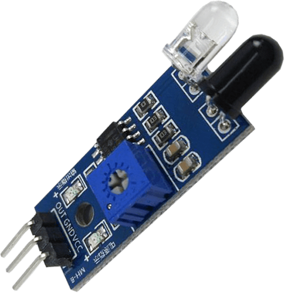
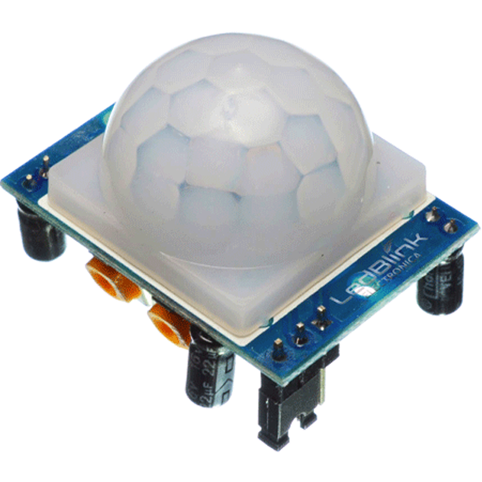
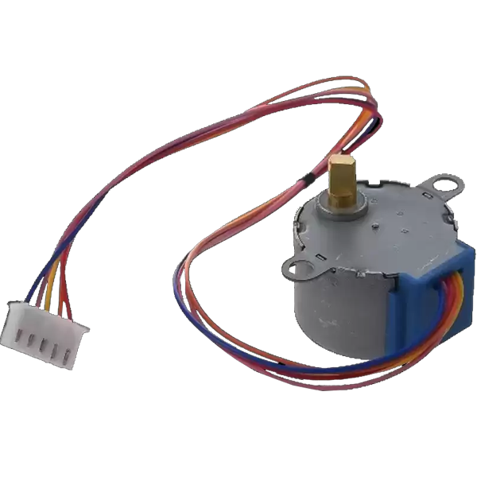
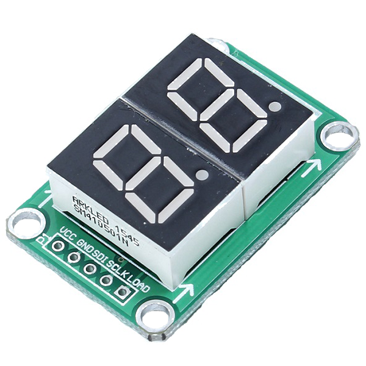

# Manual de Códigos Modulo Rriet

Bienvenido al **Manual de Códigos del modulo Rriet**.  
Selecciona un componente para ver su código listo para copiar y pegar.  

---

---

## Sensores

- <a href="Sensores/ultrasonico/" class="componente">Sensor Ultrasonico HC-SR04</a>   
- <a href="Sensores/infrarrojo/" class="componente">Sensor IR</a>  
- <a href="Sensores/temperatura/" class="componente">Sensor de Temperatura (DHT11)</a> 
- <a href="Sensores/humedadtierra/" class="componente">Sensor de Humedad en la Tierra</a> 
- <a href="Sensores/humedad/" class="componente">Sensor de Lluvia</a> 
- <a href="Sensores/movimiento/" class="componente">Sensor de Movimiento PIR</a> 
- <a href="Sensores/flama/" class="componente">Sensor de Flama</a> 
- <a href="Sensores/gas/" class="componente">Sensor de Gas</a> 

---

## Actuadores

- <a href="Actuadores/servo/" class="componente">Servo Motor</a> 
- <a href="Actuadores/motorpasos/" class="componente">Motor a pasos</a> 
- <a href="Actuadores/rgb/" class="componente">LED RGB</a>   
- <a href="Actuadores/rele/" class="componente">Relevador (Relay)</a>   
- <a href="Actuadores/laser/" class="componente">Laser (HW-493)</a>   
- <a href="Actuadores/buzzer/" class="componente">Buzzer</a>   

---

## Displays

<a href="Pantalla/lcd/" class="componente">LCD</a> 
<a href="Pantalla/matriz/" class="componente">Matriz LED</a> 
<a href="Pantalla/segmentos/" class="componente">Display 7 segmentos (74HC595)</a> 

---

## Otros módulos

<a href="Otros/bluetooth/" class="componente">Módulo Bluetooth HC-05</a> 
<a href="Otros/pote/" class="componente">Potenciómetro</a> 
<a href="Otros/joystick/" class="componente">Joystick Analógico</a> 

